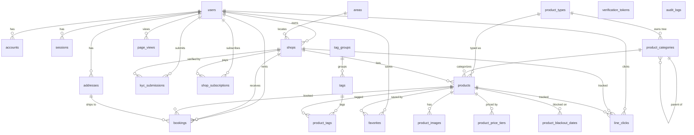

# DB Restructure — Phase 1 Design (rev 3 — taxonomy change orders applied)

> Branch: `db-restructure-Dunkin` (sub-branch of `db-restructure`; git forbids `db-restructure/Dunkin` because the parent branch name occupies that ref path).
> Target DB: `postgresql://…127.0.0.1:5432/doprent_restructure` (clean DB, full reset + reseed approved — no data migration).
> Status: **design only** — `prisma/schema.prisma` is rewritten as a draft and validates under Prisma 5.22 (`npx prisma@5.22.0 validate` ✅, pinned CLI — bare `npx prisma` pulls Prisma 7 which rejects this schema). No migration has been generated or run.

## 0. Rev 2 change orders (host-approved 2026-06-12)

| # | Change order | Status |
|---|---|---|
| 1 | Deep rename: `dresses`→`products` (+ all `dress_*` child tables → `product_*`), `dress_blackouts`→`product_blackout_dates`, `saved_dresses`→`favorites`, `boutiques`→`shops`, `seller_subscriptions`→`shop_subscriptions`. Prisma models renamed too (`Dress`→`Product`, `Boutique`→`Shop`, `SavedDress`→`Favorite`, `SellerSubscription`→`ShopSubscription`, `DressBlackout`→`ProductBlackoutDate`). Rationale: DopRent is a multi-product-type rental platform (dress, suit, more later), not dress-only. | ✅ applied (§2, §3) |
| 2 | New reference table `product_types` (pattern of `areas`/`occasions`) + `products.product_type_id` FK. Seed: `dress`, `suit`. | ✅ applied (§3.1) |
| 3 | Merge `admin_audit` INTO `audit_logs` — `AdminAudit` model dropped; admin reasons live in `after->>'reason'`. | ✅ applied (§6) |
| 4 | Keep `directUrl = env("DIRECT_DATABASE_URL")` in the datasource. | ✅ kept |

## 0b. Rev 3 change orders — TAXONOMY (host-approved 2026-06-12, on top of approved rev 2)

| # | Change order | Status |
|---|---|---|
| 5 | New `product_categories` — hierarchical (adjacency list, `parent_id` self-FK), dynamic, one category tree per `product_type`. `products.category_id uuid NULL` FK — host decision: **exactly ONE category per product**, nullable so products can exist before categorization. | ✅ applied (§3.2) |
| 6 | New tag system: `tag_groups` → `tags` → `product_tags` (M:N to products). Groups are filter dimensions (e.g. color, style, occasion). | ✅ applied (§3.2) |
| 7 | **DROP `occasions` + `product_occasions`** — occasions become tag_group `key='occasion'`; existing occasion keys seeded as tags in that group. `areas` stays a separate table (unchanged). | ✅ applied (§3.2, API-IMPACT §occasions) |
| 8 | Seed order: `product_types` → `product_categories` (dress tree + sample subcategories, suit tree) → `tag_groups`/`tags` → shops/products… | ✅ planned (§10) |

**Rename depth note:** since this is a clean DB (no data migration), FK *column* names are renamed too for consistency: `boutique_id`→`shop_id`, `dress_id`→`product_id` everywhere (bookings, kyc_submissions, line_clicks, product_* child tables). Prisma field names follow (`boutiqueId`→`shopId`, `dressId`→`productId`). Code impact re-mapped in `API-IMPACT.md`.

---

## 1. Goals (host-approved requirements)

1. Every table: `id uuid` PK, `created_by uuid NULL`, `created_at timestamptz NOT NULL DEFAULT CURRENT_TIMESTAMP`, `updated_by uuid NULL`, `updated_at timestamptz` auto-maintained by **one** shared trigger function `set_updated_at()`. Prisma `@updatedAt` kept (harmless — trigger wins last).
2. Convert non-conforming PKs: `page_views` / `line_clicks` (bigserial), `verification_tokens` (composite), `areas` (string business key), `dress_blackouts` (composite) → all `id uuid`; business keys kept as `UNIQUE`. (`admin_audit` bigserial disappears entirely — merged into `audit_logs`, §6; `occasions`' string PK disappears with the table — dropped in rev 3, replaced by the tag system.)
3. NextAuth tables get full audit-column alignment, while staying `@auth/prisma-adapter` compatible (risk analysis in §8).
4. Hard delete everywhere — no soft-delete columns added; existing status enums are genuine workflow states and are kept (audit of this in §5.4).
5. New `audit_logs` table + Prisma client extension that injects `created_by`/`updated_by` and writes audit rows automatically (skeleton in §7, full implementation = Phase 3).
6. `COMMENT ON TABLE/COLUMN` for everything in migration SQL + matching `///` doc comments in `schema.prisma` (done in the draft).
7. Normalize where it genuinely helps + flexibility for future change; no speculative tables.
8. *(rev 2)* Product-type-agnostic naming + `product_types` extensibility for suit/other rentals.
9. *(rev 3)* Dynamic taxonomy: hierarchical `product_categories` per product type + generic tag system (`tag_groups`/`tags`/`product_tags`) replacing the hard-coded `occasions` dimension — new filter dimensions become seed/admin data, not schema changes.

---

## 2. ERD (target)



New tables: `product_types`, `product_categories` *(rev 3)*, `tag_groups` *(rev 3)*, `tags` *(rev 3)*, `product_tags` *(rev 3)*, `product_images`, `product_price_tiers`, `favorites`, `audit_logs`.
Renamed tables (rev 2): `dresses`→`products`, `boutiques`→`shops`, `dress_blackouts`→`product_blackout_dates`, `saved_dresses`→`favorites` (was new in rev 1), `seller_subscriptions`→`shop_subscriptions`.
Dropped tables: `admin_audit` (merged into `audit_logs`); *(rev 3)* `occasions` + `product_occasions` (replaced by the tag system — occasions become tag_group `key='occasion'`).
Dropped columns: `dresses.boutique_name`, `dresses.images`, `dresses.price_tiers`, `dresses.occasions`, `users.saved_dress_ids`, `boutiques.area_key`.
New columns (rev 3): `products.category_id uuid NULL` FK → `product_categories` (exactly one category per product).

---

## 3. Per-table change list (old → new)

| Old table | New table (model) | Change |
|---|---|---|
| — | **product_types** *(new)* (`ProductType`) | Reference table, same pattern as areas: `id uuid` PK, `key text UNIQUE`, `label text`, `is_active bool default true`, audit cols, Thai `///` comments. Seed rows: `dress`, `suit`. |
| — | **product_categories** *(new, rev 3)* (`ProductCategory`) | Hierarchical categories, adjacency list: `id uuid` PK, `parent_id uuid NULL` self-FK (**RESTRICT**, §3.2), `product_type_id uuid NOT NULL` FK → `product_types` (**RESTRICT**) — one category tree belongs to one type, `key text UNIQUE`, `label text`, `sort_order int default 0`, `is_active bool default true`, audit cols. Indexes: `parent_id`, `product_type_id`. Seed: dress tree (e.g. `evening-dress`, `thai-traditional`), suit tree (§10). |
| — | **tag_groups** *(new, rev 3)* (`TagGroup`) | `id uuid` PK, `key text UNIQUE` (e.g. `color`, `style`, `occasion`), `label text`, `sort_order int default 0`, `is_active bool default true`, audit cols. |
| — | **tags** *(new, rev 3)* (`Tag`) | `id uuid` PK, `tag_group_id uuid NOT NULL` FK → `tag_groups` (**RESTRICT**, §3.2), `key text UNIQUE` (global, e.g. `wedding`), `label text`, `is_active bool default true`, audit cols. Index: `tag_group_id`. No `sort_order` per host spec — ordering comes from `tag_groups.sort_order` + label. |
| — | **product_tags** *(new, rev 3)* (`ProductTag`) | M:N join: `id uuid` PK, `product_id` FK CASCADE, `tag_id` FK CASCADE, audit cols, `UNIQUE(product_id, tag_id)`, index `tag_id`. Replaces `product_occasions`. |
| **occasions** | **— DROPPED** *(rev 3)* | Host decision: occasions become tag_group `key='occasion'`; the old occasion keys (`wedding`, `graduation`, …) are seeded as `tags` rows in that group. `th`/`en` labels → `tags.label` (Thai); `color_token` has no tag-system column — moves to a UI-side constant keyed by tag `key` (see API-IMPACT §occasions). |
| **areas** | areas (`Area`) | PK `key text` → `id uuid`; `key` becomes `UNIQUE`; + `is_active`; + audit cols. **Stays a separate table (host decision rev 3 — NOT folded into tags).** |
| **users** | users (`User`) | − `saved_dress_ids uuid[]` (→ `favorites` table); + `created_by`/`updated_by`; all timestamps → `timestamptz`. NextAuth fields untouched. |
| **accounts** | accounts (`Account`) | + 4 audit cols (`id` already uuid). Adapter field names untouched. + index on `user_id`. |
| **sessions** | sessions (`Session`) | + 4 audit cols; + index on `user_id`. |
| **verification_tokens** | verification_tokens (`VerificationToken`) | Composite PK `(identifier, token)` → `id uuid` PK; compound `UNIQUE(identifier, token)` and `UNIQUE(token)` kept; + audit cols. |
| **boutiques** | **shops** (`Boutique`→`Shop`) | RENAMED. `area_key text` → `area_id uuid` FK → `areas.id` (`ON DELETE SET NULL`); `ads_tier` enum `AdsTier` → unified `PlanTier`; + `created_by`/`updated_by`; `area_label` kept as display fallback for free-text areas. |
| **dresses** | **products** (`Dress`→`Product`) | RENAMED. + `product_type_id uuid NOT NULL` FK → `product_types.id` (`ON DELETE RESTRICT`, §3.1); *(rev 3)* + `category_id uuid NULL` FK → `product_categories.id` (`ON DELETE SET NULL`, §3.2); `boutique_id`→`shop_id`; − `boutique_name` (join `shops.name`); − `images json` (→ `product_images`); − `price_tiers json` (→ `product_price_tiers`); − `occasions text[]` (→ `product_tags`, rev 3); `ads_tier` → `PlanTier`; + audit cols. `search_vector tsvector`, `views`, `tag_code`, `slug` unchanged. + indexes on `product_type_id`, `category_id`. |
| — | **product_images** *(new)* (`ProductImage`) | `id uuid`, `product_id` FK CASCADE, `url`, `alt?`, `sort_order int default 0`, audit cols. Index `(product_id, sort_order)`. |
| — | **product_price_tiers** *(new)* (`ProductPriceTier`) | `id uuid`, `product_id` FK CASCADE, `min_days int`, `price_per_day int`, audit cols. `UNIQUE(product_id, min_days)`. |
| — | **favorites** *(new)* (`Favorite`) | Replaces `users.saved_dress_ids uuid[]`. `id uuid`, `user_id` FK CASCADE, `product_id` FK CASCADE, audit cols. `UNIQUE(user_id, product_id)`. |
| **kyc_submissions** | kyc_submissions (`KycSubmission`) | `boutique_id`→`shop_id`; `submitted_at` → standard `created_at`; + `updated_at`/`updated_by`/`created_by`; `plan` enum `KycPlan(Free/Boost/Featured)` → `PlanTier(free/boost/featured)` ⚠ value-case change, see §5.3. |
| **line_clicks** | line_clicks (`LineClick`) | PK `bigserial` → `id uuid`; `dress_id`→`product_id`, `boutique_id`→`shop_id`; + audit cols; timestamps → timestamptz. |
| **page_views** | page_views (`PageView`) | PK `bigserial` → `id uuid`; + audit cols; timestamps → timestamptz. |
| **seller_subscriptions** | **shop_subscriptions** (`SellerSubscription`→`ShopSubscription`) | RENAMED. `boutique_id`→`shop_id`; `plan` `SubPlan` → `PlanTier`; + `created_by`/`updated_by`. |
| **addresses** | addresses (`Address`) | + `updated_at`/`updated_by`/`created_by`. |
| **bookings** | bookings (`Booking`) | `boutique_id`→`shop_id`, `dress_id`→`product_id`; `cancel_from_status text` → `booking_status` enum; + `created_by`/`updated_by`; timestamps → timestamptz. Snapshot columns deliberately kept denormalized — point-in-time copies, not duplication. |
| **dress_blackouts** | **product_blackout_dates** (`DressBlackout`→`ProductBlackoutDate`) | RENAMED. Composite PK `(dress_id, date)` → `id uuid` PK + `UNIQUE(product_id, date)`; + audit cols. |
| **admin_audit** | **— DROPPED** (merged into `audit_logs`) | Host decision (rev 2 §6). PK bigserial disappears with the table. |
| — | **audit_logs** *(new)* (`AuditLog`) | `id uuid`, `action audit_action enum(CREATE/UPDATE/DELETE)`, `entity_type text`, `entity_id uuid?`, `actor_id uuid?`, `before jsonb?`, `after jsonb?`, `created_at timestamptz`. Append-only — **no** `updated_*` columns by design. Indexes: `(entity_type, entity_id)`, `(actor_id)`, `(created_at desc)`. Also absorbs admin business actions (§6). |

### 3.1 `products.product_type_id` — NOT NULL + ON DELETE RESTRICT (justification)

- **NOT NULL**: type is core categorization for a multi-product platform — browse/filter/SEO all key off it. A typeless product is meaningless; clean DB + seed means there is no legacy NULL population to accommodate.
- **RESTRICT** (over SET NULL): `product_types` is curated reference data, like `areas`. Retiring a type is done via `is_active = false` (column exists for exactly this), never via DELETE. RESTRICT makes an accidental admin/psql delete fail loudly instead of silently stripping categorization from (with SET NULL) every product of that type — which would also violate NOT NULL anyway. SET NULL was rejected because it both forces the column nullable and destroys data on a reference-table mistake.

### 3.2 Taxonomy ON DELETE decisions (rev 3 — justifications)

| FK | Behavior | Why |
|---|---|---|
| `product_categories.parent_id` → `product_categories.id` | **RESTRICT** | The host left this to design discretion. CASCADE would silently delete an entire subtree (and SET-NULL every product under it) from one mistaken delete; SET NULL would silently promote children to root categories, corrupting the tree shape. RESTRICT forces an explicit choice: re-parent or delete children first, leaves only. Retirement path for a whole branch = `is_active = false` (UI hides inactive branches). |
| `product_categories.product_type_id` → `product_types.id` | **RESTRICT** | Same reasoning as `products.product_type_id` (§3.1): types are curated reference data; a tree must not lose its owning type. |
| `products.category_id` → `product_categories.id` | **SET NULL** | The column is nullable *by host decision* — "uncategorized" is a legal product state (products can exist before categorization). Categories are *dynamic* admin-managed data (created/merged/pruned far more often than types), so blocking every leaf-category delete behind its products (RESTRICT) would make day-to-day curation painful. On delete, products degrade gracefully to uncategorized and surface in an "needs category" admin view for re-assignment. Note the asymmetry with `product_type_id` is deliberate: type is mandatory identity, category is optional curation. |
| `tags.tag_group_id` → `tag_groups.id` | **RESTRICT** | A tag without a group is meaningless (groups ARE the filter dimensions). Deleting a group with live tags should fail loudly; retire via `is_active = false`. |
| `product_tags.product_id` / `product_tags.tag_id` | **CASCADE** (host-specified) | Pure join rows — they have no meaning once either side is gone. Deleting a tag intentionally strips it from all products (that *is* the operation). |

**One-category-per-product** (host decision): `category_id` is a plain FK column on `products`, not a join table — the DB itself enforces "exactly one (or none)". Multi-category needs later would be additive (a join table can be introduced without dropping the column).

**Adjacency list** (over closure table / ltree): tree is small (tens of rows), read-heavy, depth ≤ 3 in practice. Recursive lookups are done in app code over the fully-loaded (cached) category list; closure tables/ltree are over-engineering at this size and complicate Prisma modeling.

**Enum changes** (all enums get explicit snake_case DB type names via `@@map` — clean DB naming, zero TS impact since Prisma names are unchanged):

| Old | New | Notes |
|---|---|---|
| `AdsTier`, `SubPlan`, `KycPlan` (3 duplicate enums) | single `PlanTier { free, boost, featured }` | KycPlan was capitalized → forms/actions comparing `"Boost"` must change (mapped in API-IMPACT §enum). |
| `Status` | unchanged values, DB type renamed `listing_status` | |
| — | new `AuditAction { CREATE, UPDATE, DELETE }` | |
| others | values unchanged, DB type names mapped (`user_role`, `booking_status`, …) | |

---

## 4. Standard audit columns + shared trigger

Every table (except append-only `audit_logs`) carries:

```sql
created_by uuid NULL,          -- no FK: must survive hard-deleting the user
created_at timestamptz NOT NULL DEFAULT CURRENT_TIMESTAMP,
updated_by uuid NULL,
updated_at timestamptz NOT NULL DEFAULT CURRENT_TIMESTAMP
```

`created_by`/`updated_by` intentionally have **no FK to `users`**: hard-delete policy (req. 4) means users can disappear; audit provenance must not block deletion (`ON DELETE SET NULL` would silently destroy provenance, RESTRICT would block deletes). Same for `audit_logs.actor_id`.

### Trigger SQL (goes in the Phase 2 migration, after the Prisma-generated DDL)

```sql
-- One shared function, one trigger per table. Simple by design.
CREATE OR REPLACE FUNCTION set_updated_at() RETURNS trigger
LANGUAGE plpgsql AS $$
BEGIN
  NEW.updated_at := CURRENT_TIMESTAMP;
  RETURN NEW;
END $$;

-- repeat for every table that has updated_at (all except audit_logs):
CREATE TRIGGER trg_users_updated_at
  BEFORE UPDATE ON users
  FOR EACH ROW EXECUTE FUNCTION set_updated_at();
-- ... product_types, product_categories, tag_groups, tags, areas, accounts,
--     sessions, verification_tokens, shops, products, product_images,
--     product_price_tiers, product_tags, favorites, kyc_submissions,
--     line_clicks, page_views, shop_subscriptions, addresses, bookings,
--     product_blackout_dates
```

Interaction with Prisma `@updatedAt`: Prisma sets `updated_at` in the UPDATE statement; the BEFORE trigger then overwrites it with `CURRENT_TIMESTAMP`. Values agree to within milliseconds; the trigger also covers raw SQL and psql edits that bypass Prisma. Kept both per host decision ("keep @updatedAt where harmless").

---

## 5. Normalization rationale (why each change, and what we did NOT do)

### 5.1 New child/join tables — each fixes a real defect

| Change | Defect it fixes | Flexibility gained |
|---|---|---|
| `dresses.images Json` → `product_images` | Unvalidated JSON blob; no ordering guarantee; can't reference a single image. | `alt` (a11y/SEO), `sort_order` (explicit cover image), future per-image metadata without schema surgery. |
| `dresses.price_tiers Json` → `product_price_tiers` | JSON shape enforced only in TS; `UNIQUE(product_id, min_days)` impossible. | DB-level integrity for the pricing engine (`lib/pricing.ts`); queryable for analytics ("which shops use tiered pricing"). |
| `dresses.occasions text[]` → `product_tags` (via tag system, rev 3) | Array of strings with **no FK** — typos/orphans possible; `hasSome` filters can't use a reference table; admin metrics needs `unnest()` raw SQL; adding a new filter dimension (style, fabric, …) meant a new column + new code. | Real FK integrity; tag rename/merge becomes one-row update; metrics becomes a plain JOIN; **any new filter dimension = one `tag_groups` row + tags (zero schema change)**. |
| *(rev 3)* `products.category_id` → `product_categories` (hierarchical) | No category concept at all — "type" was the only axis, too coarse for browse/SEO landing pages. | Dynamic per-type category trees managed as data; subcategory landing pages (`/browse?category=evening-dress`) without schema work. |
| `users.saved_dress_ids uuid[]` → `favorites` | Deleted products leave dangling ids forever; no "saved at" timestamp; counting saves per product requires array scans. | CASCADE cleanup; per-product favorite counts (future popularity signal); timestamps. |
| `boutiques.area_key` → `shops.area_id` FK | String pseudo-FK referenced a string PK. | Proper FK; `areas.key` still UNIQUE so URL/filter lookups by key keep working. |
| drop `dresses.boutique_name` | Classic update anomaly — renaming a shop strands stale names on every product. It's a live pointer, not a snapshot (unlike booking snapshots). | One source of truth; Prisma `include: { shop: { select: { name: true } } }` is cheap (indexed FK). |
| *(rev 2)* `products.product_type_id` → `product_types` | Product type was implicit ("everything is a dress") — blocking suit/other rentals. | New rental categories = one seed row, no schema change. |

### 5.2 Deliberately KEPT denormalizations (justified)

- **`bookings.*` snapshots** (rental_total, deposit, commission_rate, recipient/phone/address_text): point-in-time legal/financial copies — correct as columns.
- **`shops.kyc_status`** rollup: cheap feature-gate; authoritative history stays in `kyc_submissions`. Kept in sync by the KYC review action (already the case).
- **`shops.area_label`**: display fallback for shops in areas not in the reference table; nullable FK + free label is the simplest model for "curated list + free text".
- **`products.views`** counter: hot-path increment; moving to an events table is over-engineering at this stage (page_views already exists for funnel analytics).
- **attribution columns** on users/line_clicks/page_views/bookings: write-once event payloads, not relational data.

### 5.3 Enum unification (PlanTier)

`AdsTier`, `SubPlan`, `KycPlan` were three enums with the same three semantic values; `KycPlan` alone was capitalized. One `plan_tier` enum removes the case-mismatch trap (`kyc.plan === "Boost"` vs `boutique.adsTier === "boost"` in today's `app/actions/admin.ts`). Migration cost is small and is mapped in API-IMPACT (KycWizard, seller.ts, admin.ts).

### 5.4 Hard-delete audit (req. 4)

Searched for soft-delete patterns: there is **no** `deleted/archived/is_deleted` state anywhere. `Status(pending/live/rejected/draft)`, `BookingStatus(...cancelled...)`, `SubStatus(cancelled/expired)` are genuine workflow states → all kept. Nothing to drop; policy going forward: deletions are `DELETE` + an `audit_logs` row (before-image preserved in `before` jsonb), never a status flip.

---

## 6. Audit design — single `audit_logs` table (rev 2: admin_audit merged in, host decision)

The rev 1 draft kept a separate `admin_audit` table; the host overrode this: **`admin_audit` is dropped**. `audit_logs` serves both purposes:

1. **Mechanical rows** — written automatically by the Prisma client extension (§7) for every mutating operation: `action` = real op (CREATE/UPDATE/DELETE), `entity_type` = Prisma model name (`"Product"`, `"Booking"`, …), full `before`/`after` row images.
2. **Admin business rows** — written explicitly by admin server actions (approve KYC, reject product, feature shop, …). Convention:
   - `action`: the actual mutation kind (almost always `UPDATE`).
   - `entity_type` / `entity_id`: the business target (`"KycSubmission"`, `"Product"`, `"Shop"` — same vocabulary as mechanical rows so one filter works for both).
   - `actor_id`: the admin's user id.
   - `after` jsonb carries the business payload: `{ "admin_action": "approve_kyc", "reason": "<human-entered reason>", ...extra }`. The human reason is read via `after->>'reason'`; the business verb via `after->>'admin_action'`.
   - `before` may carry the prior business state (e.g. `{ "status": "pending" }`) — optional.

   Note: because admin actions also mutate rows through the extended client, an admin approve produces **two** rows — the mechanical UPDATE (full row diff) and the business row (intent + reason). This duplication is accepted: the mechanical row is forensics, the business row is the UI-facing activity feed. (Alternative — enriching the mechanical row in-flight — couples the extension to business logic; rejected.)

### 6.1 How the admin UI reads it

Today's `/admin` audit views read `db.adminAudit.findMany(...)`. After the merge they read `audit_logs` filtered to business rows:

```ts
db.auditLog.findMany({
  where: {
    actorId: { not: null },
    after: { path: ["admin_action"], not: Prisma.DbNull }, // business rows only
    // optional drill-downs:
    // entityType: "KycSubmission",
    // after: { path: ["admin_action"], equals: "approve_kyc" },
  },
  orderBy: { createdAt: "desc" },
});
```

The existing indexes `(entity_type, entity_id)` and `(created_at desc)` cover the list and per-entity views. If the jsonb-path filter proves slow at scale, add a partial expression index in a later migration: `CREATE INDEX ON audit_logs ((after->>'admin_action')) WHERE after ? 'admin_action';` — not needed at current volume, flagged only.

Helper for Phase 3/4 (replaces today's `logAdminAction` in `app/actions/admin.ts`):

```ts
export async function logAdminAction(opts: {
  adminId: string; action: string;           // business verb e.g. "approve_kyc"
  entityType: string; entityId?: string;
  reason?: string; payload?: Record<string, unknown>;
}) {
  await base.auditLog.create({
    data: {
      action: "UPDATE", entityType: opts.entityType, entityId: opts.entityId ?? null,
      actorId: opts.adminId,
      after: { admin_action: opts.action, reason: opts.reason ?? null, ...opts.payload },
    },
  });
}
```

### 6.2 What gets audited mechanically

Excluded from extension-written `audit_logs` (noise/volume/recursion): `AuditLog` itself, `PageView`, `LineClick`, `Session`, `Account`, `VerificationToken`. Everything else is audited on create/update/delete (including the `*Many` variants — logged without before-images, see skeleton).

---

## 7. Prisma client extension — skeleton (Phase 3 implements)

Actor propagation uses `AsyncLocalStorage` so server actions/route handlers opt in with one wrapper and **nothing changes for the NextAuth adapter** (it uses the same `db`, just with `actorId = undefined`).

```ts
// lib/db-context.ts
import { AsyncLocalStorage } from "node:async_hooks";
export const dbContext = new AsyncLocalStorage<{ actorId?: string }>();
/** Wrap any server action / route body: withActor(session.user.id, () => ...) */
export const withActor = <T>(actorId: string | undefined, fn: () => Promise<T>) =>
  dbContext.run({ actorId }, fn);
```

```ts
// lib/db.ts (Phase 3 — replaces the bare singleton)
import { PrismaClient, Prisma } from "@prisma/client";
import { dbContext } from "./db-context";

const AUDIT_EXCLUDED = new Set(["AuditLog", "PageView", "LineClick", "Session", "Account", "VerificationToken"]);
const base = new PrismaClient({ log: ["error"] });

export const db = base.$extends({
  query: {
    $allModels: {
      async create({ model, args, query }) {
        const actorId = dbContext.getStore()?.actorId;
        (args.data as any) = { ...(args.data as any), createdBy: actorId, updatedBy: actorId };
        const result = await query(args);
        await writeAudit(model, "CREATE", (result as any)?.id, actorId, null, result);
        return result;
      },
      async update({ model, args, query }) {
        const actorId = dbContext.getStore()?.actorId;
        (args.data as any) = { ...(args.data as any), updatedBy: actorId };
        const before = AUDIT_EXCLUDED.has(model)
          ? null
          : await (base as any)[uncap(model)].findUnique({ where: args.where }); // 1 extra read
        const result = await query(args);
        await writeAudit(model, "UPDATE", (result as any)?.id, actorId, before, result);
        return result;
      },
      async delete({ model, args, query }) {
        const actorId = dbContext.getStore()?.actorId;
        const before = AUDIT_EXCLUDED.has(model)
          ? null
          : await (base as any)[uncap(model)].findUnique({ where: args.where });
        const result = await query(args);
        await writeAudit(model, "DELETE", (before as any)?.id, actorId, before, null);
        return result;
      },
      // createMany / updateMany / deleteMany / upsert:
      //   inject createdBy/updatedBy the same way; write ONE audit row with
      //   entity_id = null and the filter/payload in `after` (no before-images
      //   — fetching them would turn bulk ops into N+1). Documented trade-off.
    },
  },
});

async function writeAudit(
  model: string, action: "CREATE" | "UPDATE" | "DELETE",
  entityId: string | undefined, actorId: string | undefined,
  before: unknown, after: unknown,
) {
  if (AUDIT_EXCLUDED.has(model)) return;
  try {
    await base.auditLog.create({
      data: { action, entityType: model, entityId: entityId ?? null,
              actorId: actorId ?? null,
              before: before === null ? Prisma.JsonNull : (before as Prisma.InputJsonValue),
              after:  after  === null ? Prisma.JsonNull : (after  as Prisma.InputJsonValue) },
    });
  } catch (e) { console.error("[audit] write failed", model, action, e); } // never break the mutation
}
const uncap = (s: string) => s[0].toLowerCase() + s.slice(1);
```

Design notes / known trade-offs for Phase 3:

- **Audit write is non-transactional** with the mutation (simple > perfect, per host). If atomicity is later required, switch to wrapping in `base.$transaction` — flagged, not built.
- **`$queryRaw`/`$executeRaw` bypass the extension** (only `app/admin/metrics/page.tsx` uses raw SQL today, and it is read-only — verified).
- The extension changes `db`'s TS type from `PrismaClient` to `PrismaClient & $Extends...`; `lib/db.ts` consumers (48 files) are unaffected at call sites, but `PrismaAdapter(db)` typing may need `PrismaAdapter(base)` or a cast — **recommendation: pass the un-extended `base` to `PrismaAdapter`** (adapter ops shouldn't be audited anyway, and serializing `before/after` of token rows would leak secrets into audit_logs).
- `update`'s before-image read uses `args.where` which may be a non-unique filter under `updateMany` — only the singular ops do before-reads.
- Business audit rows (`logAdminAction`, §6.1) are written through `base` directly — they must not themselves be re-audited.

---

## 8. NextAuth adapter compatibility (req. 3 — verified against `@auth/prisma-adapter@2.11.2`, `next-auth@5.0.0-beta.31`, JWT session strategy)

Adapter-required field names — **all preserved exactly** in the draft (the rev 2 renames touch none of the four adapter tables):

| Model | Required fields (Prisma names) | Status |
|---|---|---|
| User | `id, name, email, emailVerified, image` | ✅ unchanged (`name` still maps to `full_name`) |
| Account | `userId, type, provider, providerAccountId, refresh_token, access_token, expires_at, token_type, scope, id_token, session_state` + `@@unique([provider, providerAccountId])` | ✅ unchanged |
| Session | `sessionToken, userId, expires` | ✅ unchanged (and barely used — JWT strategy) |
| VerificationToken | `identifier, token, expires` + compound unique | ✅ unchanged |

Risk register:

1. **`VerificationToken.id` added** — adapter v2 `useVerificationToken()` explicitly does `delete verificationToken.id` on the returned row (added upstream for MongoDB), so the new PK is safe. The custom email-verify flow queries by `token` (still UNIQUE) — unaffected (verified in `app/api/auth/*`).
2. **New audit columns on adapter tables** — all are `NULL`-able or DB-defaulted, so adapter `create()` calls that don't know about them succeed. ✅
3. **`@updatedAt` on adapter tables** — Prisma client fills it on adapter-issued updates automatically; extra returned fields are ignored by next-auth core. ✅
4. **Client extension wrapping** *(the one real risk)* — if `PrismaAdapter` receives the extended client, every OAuth sign-in would (a) try to inject `createdBy` (fine, null actor) and (b) audit-log accounts/sessions/tokens **including OAuth tokens in jsonb** — a secret-leak hazard. Mitigation (locked into the design): adapter gets the **un-extended `base`** client, and `Session/Account/VerificationToken` are in the audit exclusion set as defense-in-depth.
5. **`users.created_by` self-reference on signup** — at user-creation time there is no session; stays NULL (= self-registered). Acceptable per host spec (`created_by NULL`).
6. **`User.shops`/`User.favorites` relation renames** — relation *fields* are app-side only; the adapter never touches them. ✅

---

## 9. COMMENT ON strategy (req. 6)

- Every model/field in the draft `schema.prisma` already carries a `///` doc comment (Thai) — these are the canonical texts.
- Phase 2 generates the migration with `prisma migrate dev --create-only --name restructure_v1`, then appends to the same `migration.sql`:
  1. the `set_updated_at()` function + per-table triggers (§4),
  2. `COMMENT ON TABLE/COLUMN` statements **generated from the schema `///` comments** so SQL and Prisma never drift. Generator one-liner for Phase 2: a small `scripts/gen-comments.ts` that parses `schema.prisma` doc comments and emits `COMMENT ON COLUMN "<table>"."<column>" IS '<text>';` (escape single quotes). Example output:

```sql
COMMENT ON TABLE products IS 'สินค้าให้เช่า (เดิม dresses) — สินค้า 1 รายการของร้าน, แยกประเภทผ่าน product_types';
COMMENT ON COLUMN products.tag_code IS 'รหัส tag ติดสินค้า (UNIQUE, สร้างอัตโนมัติ)';
COMMENT ON COLUMN products.price_per_day IS 'ราคาเช่าต่อวัน (บาท จำนวนเต็ม)';
```

- Caveat: comments live only in this hand-edited migration; later `migrate dev` runs won't re-emit them. New columns added in future migrations must add their own `COMMENT ON` lines (note added to repo conventions for Phase 3 PR).

## 10. Phase 2 execution plan (for the implementing agent)

1. `npm ci` in worktree (node_modules currently absent — `npx` falls back to Prisma 7 which rejects `url` in datasource; always use the pinned local CLI / `npx prisma@5.22.0`).
2. Point `.env`/`DATABASE_URL` (+ `DIRECT_DATABASE_URL` — kept per host decision) at `doprent_restructure`; `prisma migrate reset` is approved.
3. `prisma migrate dev --create-only --name restructure_v1` → append trigger SQL + COMMENT ON block + the existing `search_vector` tsvector trigger/index, re-targeted at `products` (check the old migrations/`postgres/` dir for its definition — it must be re-created on the fresh DB against the renamed table).
4. `prisma migrate dev` to apply; rewrite `prisma/seed.ts` / `seed.dev.ts` — **seed order is host-specified (rev 3): `product_types` → `product_categories` → `tag_groups`/`tags` → shops/products…**
   1. **product_types**: `{ key: "dress", label: "ชุดเดรส" }`, `{ key: "suit", label: "สูท" }` (labels = suggested Thai; host may adjust copy).
   2. **product_categories** (at least — keys/labels are suggestions for host sign-off):
      - dress tree: root `{ key: "dress-all", label: "ชุดเดรสทั้งหมด" }` with sample subcategories `{ key: "evening-dress", label: "ชุดราตรี" }`, `{ key: "thai-traditional", label: "ชุดไทย" }` (parent = dress root);
      - suit tree: root `{ key: "suit-all", label: "สูททั้งหมด" }`.
      Each category row sets `product_type_id` by type-`key` lookup; children set `parent_id`.
   3. **tag_groups + tags**: group `{ key: "occasion", label: "โอกาสใช้งาน", sort_order: 0 }`; its tags seeded **from the current occasions seed data** — one tag per existing occasion key (`wedding`, `graduation`, …) with the Thai name as `label`. (Old `color_token`/`en` have no tag column — handled UI-side, see API-IMPACT §occasions. Additional groups like `style` can be seeded later — data, not schema.)
   4. **areas** (unchanged table): uuid PK + `key` unique.
   5. **shops/products…**: product seed connects `productType` by `key: "dress"`, sets `category_id` by category-`key` lookup (nullable — uncategorized is legal), splits images/tiers into child tables, and maps the old per-product occasion keys to `product_tags` rows via tag-`key` lookup; shops connect area by `key` lookup; KYC plan values lowercase.
5. Phase 3: implement §7 extension + `withActor` adoption + `logAdminAction` (§6.1); Phase 4: API/UI updates per `API-IMPACT.md` (now includes the model-rename sweep).
