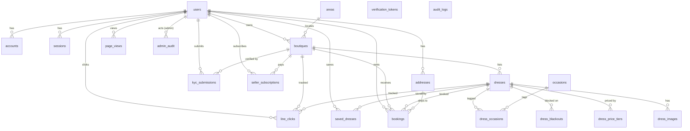

# DB Restructure — Phase 1 Design (DRAFT for host review)

> Branch: `db-restructure-Dunkin` (sub-branch of `db-restructure`; git forbids `db-restructure/Dunkin` because the parent branch name occupies that ref path).
> Target DB: `postgresql://…127.0.0.1:5432/doprent_restructure` (clean DB, full reset + reseed approved — no data migration).
> Status: **design only** — `prisma/schema.prisma` is rewritten as a draft and validates under Prisma 5.22 (`npx prisma@5.22.0 validate` ✅). No migration has been generated or run.

---

## 1. Goals (host-approved requirements)

1. Every table: `id uuid` PK, `created_by uuid NULL`, `created_at timestamptz NOT NULL DEFAULT CURRENT_TIMESTAMP`, `updated_by uuid NULL`, `updated_at timestamptz` auto-maintained by **one** shared trigger function `set_updated_at()`. Prisma `@updatedAt` kept (harmless — trigger wins last).
2. Convert non-conforming PKs: `admin_audit` / `page_views` / `line_clicks` (bigserial), `verification_tokens` (composite), `occasions` / `areas` (string business key), `dress_blackouts` (composite) → all `id uuid`; business keys kept as `UNIQUE`.
3. NextAuth tables get full audit-column alignment, while staying `@auth/prisma-adapter` compatible (risk analysis in §8).
4. Hard delete everywhere — no soft-delete columns added; existing status enums are genuine workflow states and are kept (audit of this in §5.4).
5. New `audit_logs` table + Prisma client extension that injects `created_by`/`updated_by` and writes audit rows automatically (skeleton in §7, full implementation = Phase 3).
6. `COMMENT ON TABLE/COLUMN` for everything in migration SQL + matching `///` doc comments in `schema.prisma` (done in the draft).
7. Normalize where it genuinely helps + flexibility for future change; no speculative tables.

---

## 2. ERD (target)



New tables: `dress_images`, `dress_price_tiers`, `dress_occasions`, `saved_dresses`, `audit_logs`.
Dropped columns: `dresses.boutique_name`, `dresses.images`, `dresses.price_tiers`, `dresses.occasions`, `users.saved_dress_ids`, `boutiques.area_key`.

---

## 3. Per-table change list (old → new)

| Table | Change |
|---|---|
| **occasions** | PK `key text` → `id uuid`; `key` becomes `UNIQUE`; + `is_active bool default true`; + audit cols. |
| **areas** | Same as occasions (PK → uuid, `key UNIQUE`, `is_active`, audit cols). |
| **users** | − `saved_dress_ids uuid[]` (→ `saved_dresses` table); + `created_by`/`updated_by`; all timestamps → `timestamptz`. NextAuth fields untouched. |
| **accounts** | + 4 audit cols (`id` already uuid). Adapter field names untouched. + index on `user_id`. |
| **sessions** | + 4 audit cols; + index on `user_id`. |
| **verification_tokens** | Composite PK `(identifier, token)` → `id uuid` PK; compound `UNIQUE(identifier, token)` and `UNIQUE(token)` kept; + audit cols. |
| **boutiques** | `area_key text` → `area_id uuid` FK → `areas.id` (`ON DELETE SET NULL`); `ads_tier` enum `AdsTier` → unified `PlanTier` (same lowercase values, no data change); + `created_by`/`updated_by`; `area_label` kept as display fallback for free-text areas. |
| **dresses** | − `boutique_name` (join `boutiques.name`); − `images json` (→ `dress_images`); − `price_tiers json` (→ `dress_price_tiers`); − `occasions text[]` (→ `dress_occasions`); `ads_tier` → `PlanTier`; + audit cols. `search_vector tsvector`, `views`, `tag_code`, `slug` unchanged. |
| **dress_images** *(new)* | `id uuid`, `dress_id` FK CASCADE, `url`, `alt?`, `sort_order int default 0`, audit cols. Index `(dress_id, sort_order)`. |
| **dress_price_tiers** *(new)* | `id uuid`, `dress_id` FK CASCADE, `min_days int`, `price_per_day int`, audit cols. `UNIQUE(dress_id, min_days)`. |
| **dress_occasions** *(new)* | `id uuid`, `dress_id` FK CASCADE, `occasion_id` FK CASCADE, audit cols. `UNIQUE(dress_id, occasion_id)`. |
| **saved_dresses** *(new)* | `id uuid`, `user_id` FK CASCADE, `dress_id` FK CASCADE, audit cols. `UNIQUE(user_id, dress_id)`. |
| **kyc_submissions** | `submitted_at` → standard `created_at`; + `updated_at`/`updated_by`/`created_by`; `plan` enum `KycPlan(Free/Boost/Featured)` → `PlanTier(free/boost/featured)` ⚠ value-case change, see §5.3. |
| **line_clicks** | PK `bigserial` → `id uuid`; + audit cols; timestamps → timestamptz. Otherwise unchanged. |
| **page_views** | Same as line_clicks. |
| **seller_subscriptions** | `plan` `SubPlan` → `PlanTier` (identical values); + `created_by`/`updated_by`. |
| **addresses** | + `updated_at`/`updated_by`/`created_by`. |
| **bookings** | `cancel_from_status text` → `booking_status` enum (same string values); + `created_by`/`updated_by`; timestamps → timestamptz. Snapshot columns (price/commission/address) deliberately kept denormalized — they are point-in-time copies, not duplication. |
| **dress_blackouts** | Composite PK `(dress_id, date)` → `id uuid` PK + `UNIQUE(dress_id, date)`; + audit cols. |
| **admin_audit** | PK `bigserial` → `id uuid`; + audit cols. Kept separate from `audit_logs` (see §6.1). |
| **audit_logs** *(new)* | Per host spec: `id uuid`, `action audit_action enum(CREATE/UPDATE/DELETE)`, `entity_type text`, `entity_id uuid?`, `actor_id uuid?`, `before jsonb?`, `after jsonb?`, `created_at timestamptz`. Append-only — **no** `updated_*` columns by design. Indexes: `(entity_type, entity_id)`, `(actor_id)`, `(created_at desc)`. |

**Enum changes** (all enums now get explicit snake_case DB type names via `@@map` — clean DB naming, zero TS impact since Prisma names are unchanged):

| Old | New | Notes |
|---|---|---|
| `AdsTier`, `SubPlan`, `KycPlan` (3 duplicate enums) | single `PlanTier { free, boost, featured }` | KycPlan was capitalized → forms/actions comparing `"Boost"` must change (mapped in API-IMPACT §enum). |
| `Status` | unchanged values, DB type renamed `listing_status` | |
| — | new `AuditAction { CREATE, UPDATE, DELETE }` | |
| others | values unchanged, DB type names mapped (`user_role`, `booking_status`, …) | |

---

## 4. Standard audit columns + shared trigger

Every table (except append-only `audit_logs`) carries:

```sql
created_by uuid NULL,          -- no FK: must survive hard-deleting the user
created_at timestamptz NOT NULL DEFAULT CURRENT_TIMESTAMP,
updated_by uuid NULL,
updated_at timestamptz NOT NULL DEFAULT CURRENT_TIMESTAMP
```

`created_by`/`updated_by` intentionally have **no FK to `users`**: hard-delete policy (req. 4) means users can disappear; audit provenance must not block deletion (`ON DELETE SET NULL` would silently destroy provenance, RESTRICT would block deletes). Same for `audit_logs.actor_id`.

### Trigger SQL (goes in the Phase 2 migration, after the Prisma-generated DDL)

```sql
-- One shared function, one trigger per table. Simple by design.
CREATE OR REPLACE FUNCTION set_updated_at() RETURNS trigger
LANGUAGE plpgsql AS $$
BEGIN
  NEW.updated_at := CURRENT_TIMESTAMP;
  RETURN NEW;
END $$;

-- repeat for every table that has updated_at (all except audit_logs):
CREATE TRIGGER trg_users_updated_at
  BEFORE UPDATE ON users
  FOR EACH ROW EXECUTE FUNCTION set_updated_at();
-- ... occasions, areas, accounts, sessions, verification_tokens, boutiques,
--     dresses, dress_images, dress_price_tiers, dress_occasions, saved_dresses,
--     kyc_submissions, line_clicks, page_views, seller_subscriptions,
--     addresses, bookings, dress_blackouts, admin_audit
```

Interaction with Prisma `@updatedAt`: Prisma sets `updated_at` in the UPDATE statement; the BEFORE trigger then overwrites it with `CURRENT_TIMESTAMP`. Values agree to within milliseconds; the trigger also covers raw SQL and psql edits that bypass Prisma. Kept both per host decision ("keep @updatedAt where harmless").

---

## 5. Normalization rationale (why each change, and what we did NOT do)

### 5.1 New child/join tables — each fixes a real defect

| Change | Defect it fixes | Flexibility gained |
|---|---|---|
| `dresses.images Json` → `dress_images` | Unvalidated JSON blob; no ordering guarantee; can't reference a single image. | `alt` (a11y/SEO), `sort_order` (explicit cover image), future per-image metadata without schema surgery. |
| `dresses.price_tiers Json` → `dress_price_tiers` | JSON shape enforced only in TS; `UNIQUE(dress_id, min_days)` impossible. | DB-level integrity for the pricing engine (`lib/pricing.ts`); queryable for analytics ("which shops use tiered pricing"). |
| `dresses.occasions text[]` → `dress_occasions` | Array of strings with **no FK** to `occasions` — typos/orphans possible; `hasSome` filters can't use the reference table; admin metrics needs `unnest()` raw SQL. | Real FK integrity; occasion rename/merge becomes one-row update; metrics becomes a plain JOIN. |
| `users.saved_dress_ids uuid[]` → `saved_dresses` | Deleted dresses leave dangling ids forever; no "saved at" timestamp; counting saves per dress requires array scans. | CASCADE cleanup; per-dress save counts (future popularity signal); timestamps. |
| `boutiques.area_key` → `area_id` FK | String pseudo-FK referenced a string PK. | Proper FK; `areas.key` still UNIQUE so URL/filter lookups by key keep working. |
| drop `dresses.boutique_name` | Classic update anomaly — renaming a boutique strands stale names on every dress. It's a live pointer, not a snapshot (unlike booking snapshots). | One source of truth; Prisma `include: { boutique: { select: { name: true } } }` is cheap (indexed FK). |

### 5.2 Deliberately KEPT denormalizations (justified)

- **`bookings.*` snapshots** (rental_total, deposit, commission_rate, recipient/phone/address_text): point-in-time legal/financial copies — correct as columns.
- **`boutiques.kyc_status`** rollup: cheap feature-gate; authoritative history stays in `kyc_submissions`. Kept in sync by the KYC review action (already the case).
- **`boutiques.area_label`**: display fallback for boutiques in areas not in the reference table; nullable FK + free label is the simplest model for "curated list + free text".
- **`dresses.views`** counter: hot-path increment; moving to an events table is over-engineering at this stage (page_views already exists for funnel analytics).
- **attribution columns** on users/line_clicks/page_views/bookings: write-once event payloads, not relational data.

### 5.3 Enum unification (PlanTier)

`AdsTier`, `SubPlan`, `KycPlan` were three enums with the same three semantic values; `KycPlan` alone was capitalized. One `plan_tier` enum removes the case-mismatch trap (`kyc.plan === "Boost"` vs `boutique.adsTier === "boost"` in today's `app/actions/admin.ts`). Migration cost is small and is mapped in API-IMPACT (KycWizard, seller.ts, admin.ts).

### 5.4 Hard-delete audit (req. 4)

Searched for soft-delete patterns: there is **no** `deleted/archived/is_deleted` state anywhere. `Status(pending/live/rejected/draft)`, `BookingStatus(...cancelled...)`, `SubStatus(cancelled/expired)` are genuine workflow states → all kept. Nothing to drop; policy going forward: deletions are `DELETE` + an `audit_logs` row (before-image preserved in `before` jsonb), never a status flip.

---

## 6. Audit design

### 6.1 `admin_audit` vs `audit_logs` — why both stay

- `admin_audit` = **intentional business actions** with human-entered `reason` (approve KYC, reject dress). Written explicitly by admin actions. UI-facing.
- `audit_logs` = **mechanical before/after** of every mutation, written by the client extension. Forensics/debugging.
They answer different questions; merging would force `reason`/`action`-vocabulary into the mechanical log. If the host prefers one table later, `admin_audit` can collapse into `audit_logs.after->>'reason'` — flagged as optional follow-up, not done now.

### 6.2 What gets audited

Excluded from `audit_logs` (noise/volume/recursion): `AuditLog` itself, `PageView`, `LineClick`, `Session`, `Account`, `VerificationToken`. Everything else is audited on create/update/delete (including the `*Many` variants — logged without before-images, see skeleton).

---

## 7. Prisma client extension — skeleton (Phase 3 implements)

Actor propagation uses `AsyncLocalStorage` so server actions/route handlers opt in with one wrapper and **nothing changes for the NextAuth adapter** (it uses the same `db`, just with `actorId = undefined`).

```ts
// lib/db-context.ts
import { AsyncLocalStorage } from "node:async_hooks";
export const dbContext = new AsyncLocalStorage<{ actorId?: string }>();
/** Wrap any server action / route body: withActor(session.user.id, () => ...) */
export const withActor = <T>(actorId: string | undefined, fn: () => Promise<T>) =>
  dbContext.run({ actorId }, fn);
```

```ts
// lib/db.ts (Phase 3 — replaces the bare singleton)
import { PrismaClient, Prisma } from "@prisma/client";
import { dbContext } from "./db-context";

const AUDIT_EXCLUDED = new Set(["AuditLog", "PageView", "LineClick", "Session", "Account", "VerificationToken"]);
const base = new PrismaClient({ log: ["error"] });

export const db = base.$extends({
  query: {
    $allModels: {
      async create({ model, args, query }) {
        const actorId = dbContext.getStore()?.actorId;
        (args.data as any) = { ...(args.data as any), createdBy: actorId, updatedBy: actorId };
        const result = await query(args);
        await writeAudit(model, "CREATE", (result as any)?.id, actorId, null, result);
        return result;
      },
      async update({ model, args, query }) {
        const actorId = dbContext.getStore()?.actorId;
        (args.data as any) = { ...(args.data as any), updatedBy: actorId };
        const before = AUDIT_EXCLUDED.has(model)
          ? null
          : await (base as any)[uncap(model)].findUnique({ where: args.where }); // 1 extra read
        const result = await query(args);
        await writeAudit(model, "UPDATE", (result as any)?.id, actorId, before, result);
        return result;
      },
      async delete({ model, args, query }) {
        const actorId = dbContext.getStore()?.actorId;
        const before = AUDIT_EXCLUDED.has(model)
          ? null
          : await (base as any)[uncap(model)].findUnique({ where: args.where });
        const result = await query(args);
        await writeAudit(model, "DELETE", (before as any)?.id, actorId, before, null);
        return result;
      },
      // createMany / updateMany / deleteMany / upsert:
      //   inject createdBy/updatedBy the same way; write ONE audit row with
      //   entity_id = null and the filter/payload in `after` (no before-images
      //   — fetching them would turn bulk ops into N+1). Documented trade-off.
    },
  },
});

async function writeAudit(
  model: string, action: "CREATE" | "UPDATE" | "DELETE",
  entityId: string | undefined, actorId: string | undefined,
  before: unknown, after: unknown,
) {
  if (AUDIT_EXCLUDED.has(model)) return;
  try {
    await base.auditLog.create({
      data: { action, entityType: model, entityId: entityId ?? null,
              actorId: actorId ?? null,
              before: before === null ? Prisma.JsonNull : (before as Prisma.InputJsonValue),
              after:  after  === null ? Prisma.JsonNull : (after  as Prisma.InputJsonValue) },
    });
  } catch (e) { console.error("[audit] write failed", model, action, e); } // never break the mutation
}
const uncap = (s: string) => s[0].toLowerCase() + s.slice(1);
```

Design notes / known trade-offs for Phase 3:

- **Audit write is non-transactional** with the mutation (simple > perfect, per host). If atomicity is later required, switch to wrapping in `base.$transaction` — flagged, not built.
- **`$queryRaw`/`$executeRaw` bypass the extension** (only `app/admin/metrics/page.tsx` uses raw SQL today, and it is read-only — verified).
- The extension changes `db`'s TS type from `PrismaClient` to `PrismaClient & $Extends...`; `lib/db.ts` consumers (48 files) are unaffected at call sites, but `PrismaAdapter(db)` typing may need `PrismaAdapter(base)` or a cast — **recommendation: pass the un-extended `base` to `PrismaAdapter`** (adapter ops shouldn't be audited anyway, and serializing `before/after` of token rows would leak secrets into audit_logs).
- `update`'s before-image read uses `args.where` which may be a non-unique filter under `updateMany` — only the singular ops do before-reads.

---

## 8. NextAuth adapter compatibility (req. 3 — verified against `@auth/prisma-adapter@2.11.2`, `next-auth@5.0.0-beta.31`, JWT session strategy)

Adapter-required field names — **all preserved exactly** in the draft:

| Model | Required fields (Prisma names) | Status |
|---|---|---|
| User | `id, name, email, emailVerified, image` | ✅ unchanged (`name` still maps to `full_name`) |
| Account | `userId, type, provider, providerAccountId, refresh_token, access_token, expires_at, token_type, scope, id_token, session_state` + `@@unique([provider, providerAccountId])` | ✅ unchanged |
| Session | `sessionToken, userId, expires` | ✅ unchanged (and barely used — JWT strategy) |
| VerificationToken | `identifier, token, expires` + compound unique | ✅ unchanged |

Risk register:

1. **`VerificationToken.id` added** — adapter v2 `useVerificationToken()` explicitly does `delete verificationToken.id` on the returned row (added upstream for MongoDB), so the new PK is safe. The custom email-verify flow queries by `token` (still UNIQUE) — unaffected (verified in `app/api/auth/*`).
2. **New audit columns on adapter tables** — all are `NULL`-able or DB-defaulted, so adapter `create()` calls that don't know about them succeed. ✅
3. **`@updatedAt` on adapter tables** — Prisma client fills it on adapter-issued updates automatically; extra returned fields are ignored by next-auth core. ✅
4. **Client extension wrapping** *(the one real risk)* — if `PrismaAdapter` receives the extended client, every OAuth sign-in would (a) try to inject `createdBy` (fine, null actor) and (b) audit-log accounts/sessions/tokens **including OAuth tokens in jsonb** — a secret-leak hazard. Mitigation (locked into the design): adapter gets the **un-extended `base`** client, and `Session/Account/VerificationToken` are in the audit exclusion set as defense-in-depth.
5. **`users.created_by` self-reference on signup** — at user-creation time there is no session; stays NULL (= self-registered). Acceptable per host spec (`created_by NULL`).

---

## 9. COMMENT ON strategy (req. 6)

- Every model/field in the draft `schema.prisma` already carries a `///` doc comment (Thai) — these are the canonical texts.
- Phase 2 generates the migration with `prisma migrate dev --create-only --name restructure_v1`, then appends to the same `migration.sql`:
  1. the `set_updated_at()` function + per-table triggers (§4),
  2. `COMMENT ON TABLE/COLUMN` statements **generated from the schema `///` comments** so SQL and Prisma never drift. Generator one-liner for Phase 2: a small `scripts/gen-comments.ts` that parses `schema.prisma` doc comments and emits `COMMENT ON COLUMN "<table>"."<column>" IS '<text>';` (escape single quotes). Example output:

```sql
COMMENT ON TABLE dresses IS 'ชุดให้เช่า — สินค้า 1 รายการของร้าน';
COMMENT ON COLUMN dresses.tag_code IS 'รหัส tag ติดชุด (UNIQUE, สร้างอัตโนมัติ)';
COMMENT ON COLUMN dresses.price_per_day IS 'ราคาเช่าต่อวัน (บาท จำนวนเต็ม)';
```

- Caveat: comments live only in this hand-edited migration; later `migrate dev` runs won't re-emit them. New columns added in future migrations must add their own `COMMENT ON` lines (note added to repo conventions for Phase 3 PR).

## 10. Phase 2 execution plan (for the implementing agent)

1. `npm ci` in worktree (node_modules currently absent — `npx` falls back to Prisma 7 which rejects `url` in datasource; always use the pinned local CLI).
2. Point `.env`/`DATABASE_URL` at `doprent_restructure`; `prisma migrate reset` is approved.
3. `prisma migrate dev --create-only --name restructure_v1` → append trigger SQL + COMMENT ON block + the existing `search_vector` tsvector trigger/index (check the old migrations/`postgres/` dir for its definition — it must be re-created on the fresh DB).
4. `prisma migrate dev` to apply; rewrite `prisma/seed.ts` / `seed.dev.ts` (occasions/areas now uuid PK + key unique; dresses seed splits images/tiers/occasions into child tables; KYC plan values lowercase).
5. Phase 3: implement §7 extension + `withActor` adoption; Phase 4: API/UI updates per `API-IMPACT.md`.
